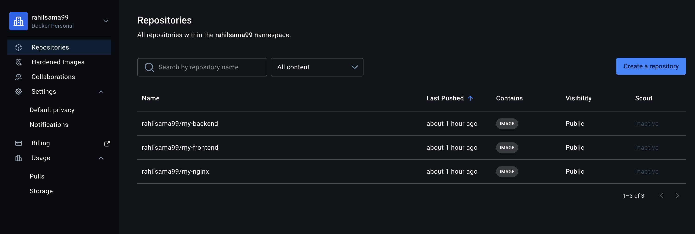
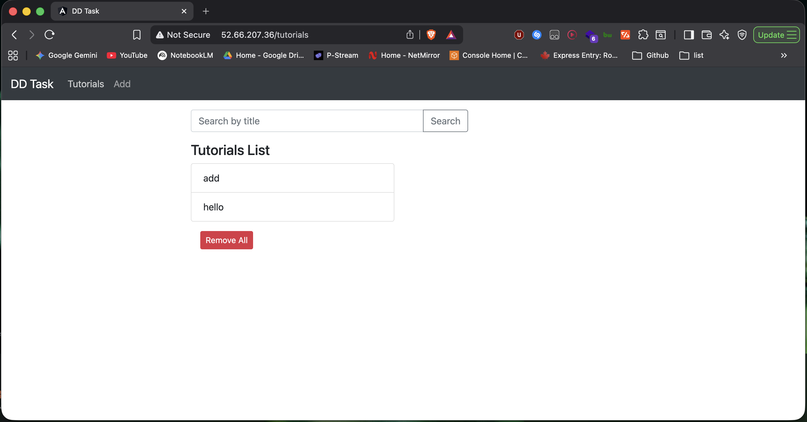
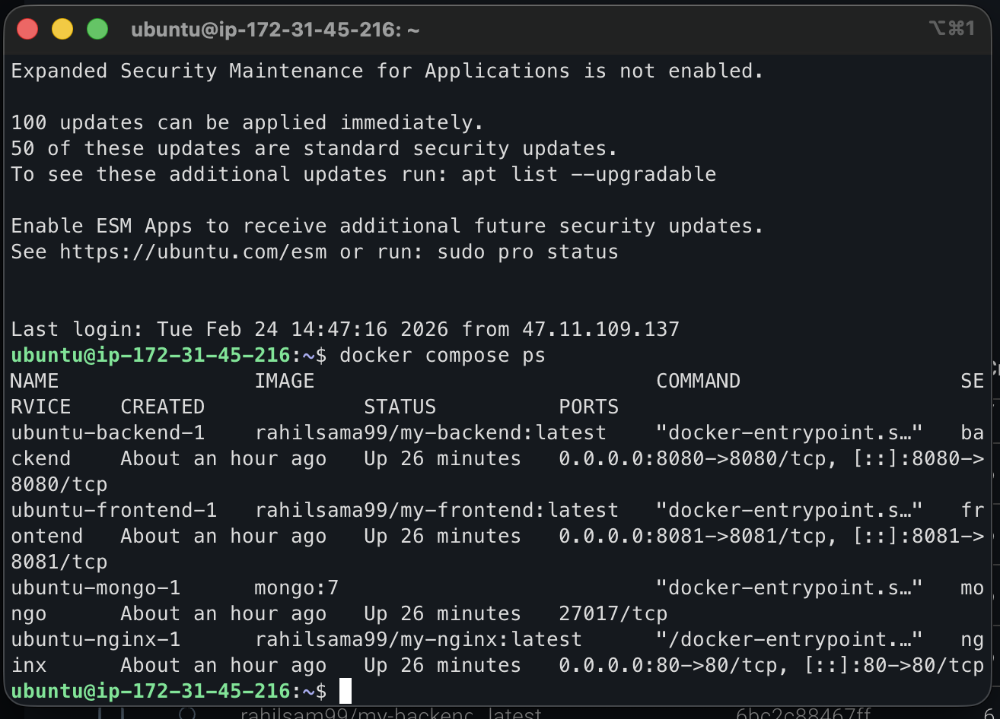

# MEAN Stack Application: Tutorials Management System


## Containerization
The application is fully containerized to ensure consistency across all environments. 
*   **Individual Dockerfiles**: Both the `frontend` and `backend` directories contain their own respective `Dockerfile`s optimized with multi-stage builds (reducing final image size).
*   **Docker Compose**: A centralized `docker-compose.yml` file is used to orchestrate the entire stack. It stands up the frontend, backend, Nginx, and MongoDB services simultaneously while managing networks, environment variables, and volumes for data persistence.

## Deployment Architecture 
This application is designed to be hosted on an Ubuntu Virtual Machine (EC2 instance on AWS) configured using Terraform. 

The architecture features **Nginx as a Reverse Proxy**.
*   Nginx listens passively on public **Port 80**.
*   Traffic arriving at `/` is internally proxied directly to the frontend Angular container.
*   Traffic arriving at `/api` is internally proxied to the backend Express container. 
*   MongoDB remains purely internal and is not exposed to the public internet, ensuring maximum security.

> [!NOTE]
> **This application is NOT meant to be run locally.** The containerized infrastructure has been explicitly pushed and deployed to an active AWS EC2 instance.
> 
> **Live IP Address:** [http://52.66.207.36/](http://52.66.207.36/)

## CI/CD Pipeline (GitHub Actions)
The repository is equipped with a robust CI/CD pipeline defined in `.github/workflows/deploy.yml`. When a push is successfully merged into the `main` branch, the pipeline executes the following automated steps:

1.  **Code Check Out:** Pulls the latest code from the repository.
2.  **Authenticate:** securely logs into Docker Hub using encrypted GitHub Secrets.
3.  **Build and Push:** Leverages Docker Buildx to build all three images (`frontend`, `backend`, and `nginx`) and pushes them to the public Docker Hub registry.
4.  **Continuous Deployment (CD):** Connects to the remote Ubuntu VM securely over SSH, authenticates with Docker Hub, and pulls the newly uploaded images.
5.  **Re-Deployment:** Executes `docker compose up -d --force-recreate` to smoothly detach and restart the containers with the newest codebase, followed by image pruning to conserve VM disk space.

---

## Deployment & Access Instructions

This application is currently deployed and running live on an AWS EC2 instance. The entire infrastructure is managed via Docker Compose.

**Access the Live Application:**
You can access the fully functional Angular frontend via the internet at the following static IP address:
[http://52.66.207.36/](http://52.66.207.36/)

All API requests from the frontend are seamlessly routed to the backend through the Nginx reverse proxy running on the same VM.

*(Note: Ensure you are using `http://` and not `https://` as SSL certificates have not been configured for this direct IP).*

---

## Step-by-Step Setup and Deployment Instructions

If you wish to deploy this application to your own infrastructure, follow these steps:

### 1. Infrastructure Provisioning
1. Provide an Ubuntu VM on your preferred Cloud Provider (e.g., AWS EC2, Azure VM).
2. Configure Security Groups/Firewall rules to allow inbound traffic on **Port 80** (HTTP) and **Port 22** (SSH).
3. Connect to your VM via SSH.
4. Install Docker and Docker Compose on the VM.
   ```bash
   sudo apt update
   sudo apt install docker.io docker-compose -y
   sudo systemctl start docker
   sudo systemctl enable docker
   sudo usermod -aG docker ubuntu
   ```

### 2. GitHub Secrets Configuration
To enable the automated CI/CD pipeline, navigate to your GitHub Repository Settings -> **Secrets and variables** -> **Actions** and add the following repository secrets:
*   `DOCKERHUB_USERNAME`: Your Docker Hub username.
*   `DOCKERHUB_TOKEN`: An access token generated from Docker Hub.
*   `EC2_HOST`: The public IP address of your Ubuntu VM.
*   `EC2_USER`: The SSH username for your VM (e.g., `ubuntu`).
*   `EC2_SSH_KEY`: The private SSH key used to access your VM.

### 3. Application Deployment
1. Commit and push your code to the `main` branch of your GitHub repository.
2. Navigate to the **Actions** tab in GitHub to monitor the CI/CD pipeline workflow.
3. The workflow will automatically build the Nginx, Node.js Backend, and Angular Frontend Docker images, push them to Docker Hub, and then SSH into your VM to pull and deploy the latest images using `docker-compose`.
4. Once the Actions workflow completes successfully, your application is live! Navigate to your VM's public IP address in your browser to view the application.

---

**Access the Live Application:**
You can access the fully functional Angular frontend via the internet at the following static IP address:
[http://52.66.207.36/](http://52.66.207.36/)

All API requests from the frontend are seamlessly routed to the backend through the Nginx reverse proxy running on the same VM.

*(Note: Ensure you are using `http://` and not `https://` as SSL certificates have not been configured for this direct IP).*

---

## Screenshots of Execution & Infrastructure

### 1. CI/CD Successful Execution


### 2. Docker Hub Image Repository




### 3. Application Deployment & Working UI




### 4. Infrastructure Status & Nginx Setup



